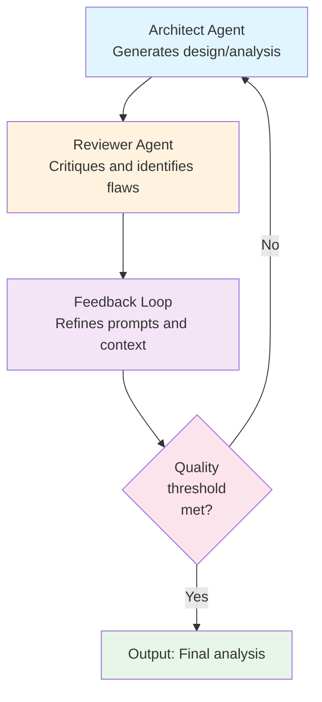

# Husseini - Refined Approach: Multi-Agent Pattern Over Model Fine-Tuning

## Core Insight

The original proposal suggests training a fine-tuned GAN/Multimodal model. A superior approach uses **multi-agent orchestration with iterative prompt refinement** instead—no model training required.

---

## 1. The Multi-Agent Loop Pattern

**Key mechanism**: Each iteration improves the prompt and context, not the underlying model weights.

---

## 2. Approach Comparison

| Factor | Fine-Tuned Model | Multi-Agent Pattern |
|--------|---|---|
| Cost | High infrastructure investment | Low - API call costs only |
| Time to market | 3-6 months | 2-4 weeks |
| Maintenance | Complex retraining cycles | Simple prompt updates |
| Flexibility | Locked after training | Iterate anytime |
| Scalability | Expensive compute | Leverage existing LLM |
| Dependency risk | Custom infrastructure | Leverage proven LLMs |

---

## 3. What You Actually Need

No fine-tuning required. Build with:

- **Base LLM**: Claude, GPT-4, or cost-effective alternatives
- **RAG layer**: Retrieve relevant Nordcloud case studies and patterns
- **Prompt templates**: Distinct architect and reviewer personas
- **Feedback loop logic**: Decision rules for iteration vs. acceptance
- **Quality gates**: Acceptance criteria and validation thresholds

---

## 4. The Real Competitive Advantage

The original proposal claimed differentiation through a fine-tuned model. **The actual differentiation is:**

- High-quality structured prompts
- Multi-agent orchestration patterns
- Access to Nordcloud's proprietary case study database
- Iterative refinement framework

This is **not about the model—it is about the patterns and the knowledge base**.

---

## 5. MVP Implementation Path

### Phase 1: Foundation (Week 1-2)

- Set up base LLM integration
- Build RAG system with Nordcloud case studies
- Define architect and reviewer prompt templates
- Create feedback loop orchestration

### Phase 2: Iteration Loop (Week 2-3)

- Implement quality gates
- Add case study retrieval logic
- Test multi-agent interaction patterns
- Refine prompts based on output quality

### Phase 3: Validation (Week 3-4)

- Test against real architectural diagrams
- Measure output quality
- Iterate prompt refinements
- Document patterns that work

---

## 6. Cost Analysis: Multi-Agent vs. Fine-Tuning

### Multi-Agent Pattern
- **Infrastructure**: Minimal (use hosted LLM APIs)
- **Development**: 4-6 weeks engineering effort
- **Running cost**: Per-API-call pricing (typically cents per analysis)
- **Total MVP investment**: Low five figures

### Fine-Tuned Model (Original Proposal)
- **Infrastructure**: Custom GPU compute, MLOps pipeline
- **Development**: 3-6 months (data preparation, training, evaluation)
- **Running cost**: High (dedicated inference infrastructure)
- **Total MVP investment**: Mid six figures

---

## 7. Positioning Revision

### Original
"Gemini but on steroids—a specialized fine-tuned model for architecture analysis"

### Refined
"An intelligent multi-agent system that leverages Nordcloud's architectural expertise and case studies to iteratively improve and validate enterprise designs—no custom model training required"

**The key shift**: Emphasize the orchestration and knowledge base, not the model.

---

## 8. Subscription Model Alignment

Multi-agent approach scales perfectly with existing tiers:

- **Platinum**: High-iteration analysis with deep case study retrieval
- **Gold**: Standard multi-pass refinement with FSI-specific prompts
- **Silver**: Quick analysis with limited iterations
- **Bronze**: Single-pass lightweight analysis

Cost per customer correlates directly with API consumption, not model infrastructure.

---

## 9. Risk Assessment

| Risk | Fine-Tuning Approach | Multi-Agent Approach |
|------|---|---|
| Model performance degradation | Requires retraining | Update prompts anytime |
| Competitive obsolescence | 6-month lag to changes | Days to weeks |
| Vendor lock-in | Custom infrastructure | Use market-leading LLMs |
| Regulatory/compliance | Custom model compliance burden | Inherit LLM provider compliance |

---

## 10. Recommendation

**Proceed with multi-agent pattern, not fine-tuned model.**

This approach:

- Reaches market 10-12 weeks faster
- Costs 90% less infrastructure investment
- Maintains flexibility for continuous improvement
- Leverages Nordcloud's unique knowledge asset (case studies)
- Scales cost-efficiently with subscription tiers

The competitive moat is not the model. It is the patterns, the orchestration, and Nordcloud's proprietary architectural knowledge.
