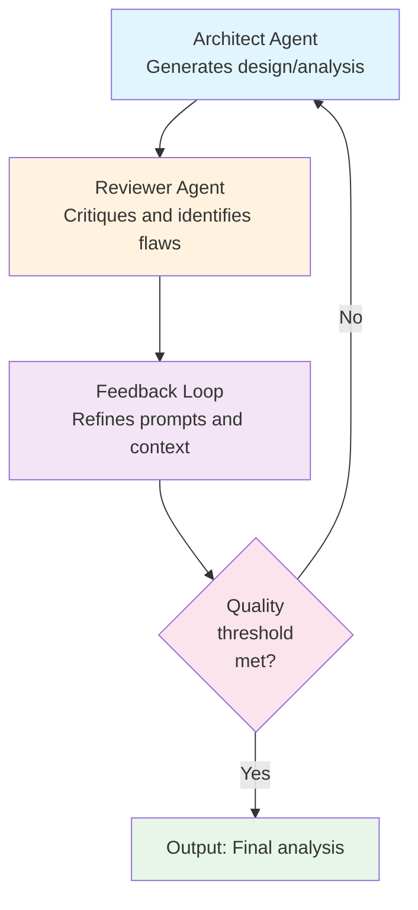

Refined Approach: Multi-Agent Pattern Over Model Fine-Tuning

## Core Insight

The original proposal suggests training a fine-tuned GAN/Multimodal model. A superior approach uses **multi-agent orchestration with iterative prompt refinement** instead—no model training required.

---

## 1. The Multi-Agent Loop Pattern

**Key mechanism**: Each iteration improves the prompt and context, not the underlying model weights.

---

## 2. Approach Comparison

| Factor | Fine-Tuned Model | Multi-Agent Pattern |
|--------|---|---|
| Cost | High infrastructure investment | Low - API call costs only |
| Time to market | 3-6 months | 2-4 weeks |
| Maintenance | Complex retraining cycles | Simple prompt updates |
| Flexibility | Locked after training | Iterate anytime |
| Scalability | Expensive compute | Leverage existing LLM |
| Dependency risk | Custom infrastructure | Leverage proven LLMs |

---

## 3. What You Actually Need

No fine-tuning required. Build with:

- **Base LLM**: Claude, GPT-4, or cost-effective alternatives
- **RAG layer**: Retrieve relevant Nordcloud case studies and patterns
- **Prompt templates**: Distinct architect and reviewer personas
- **Feedback loop logic**: Decision rules for iteration vs. acceptance
- **Quality gates**: Acceptance criteria and validation thresholds

---

## 4. The Real Competitive Advantage

The original proposal claimed differentiation through a fine-tuned model. **The actual differentiation is:**

- High-quality structured prompts
- Multi-agent orchestration patterns
- Access to Nordcloud's proprietary case study database
- Iterative refinement framework

This is **not about the model—it is about the patterns and the knowledge base**.
