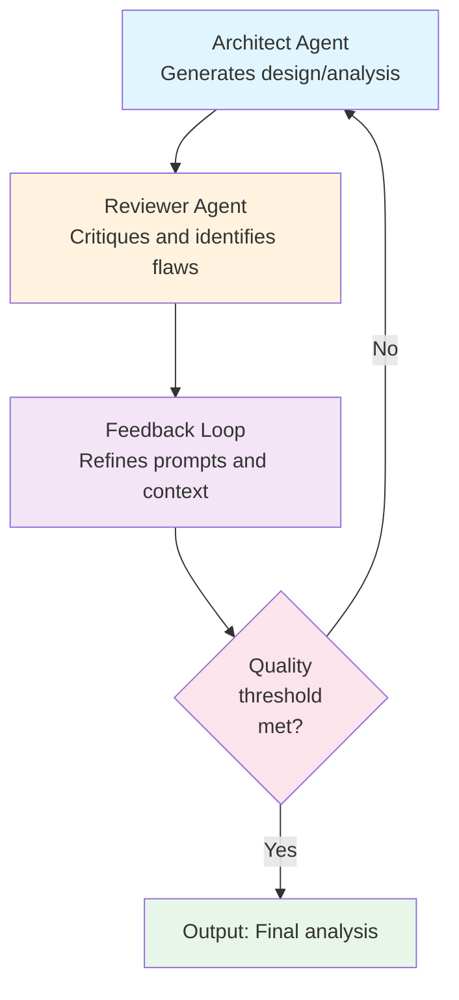

Refined Approach: Multi-Agent Pattern Over Model Fine-Tuning

## Core Insight

The original proposal suggests training a fine-tuned GAN/Multimodal model. An alternative approach worth considering: **multi-agent orchestration with iterative prompt refinement**—no model training required. Both paths are viable; this explores different trade-offs.

---

## 1. The Multi-Agent Loop Pattern

**How it works**: Each iteration improves the prompt and context, reducing dependency on model retraining.

---

## 2. Approach Comparison

| Factor | Fine-Tuned Model | Multi-Agent Pattern |
|--------|---|---|
| Infrastructure | Custom GPU compute pipeline | Hosted LLM APIs |
| Time to market | 3-6 months | 2-4 weeks |
| Iteration cycle | Requires retraining | Prompt updates only |
| Flexibility | Fixed post-training | Continuous adaptation |
| Scalability | Dedicated compute scaling | API-based scaling |
| Vendor dependency | Build custom stack | Leverage market leaders |

---

## 3. What You Actually Need

No fine-tuning required. Build with:

- **Base LLM**: Claude, GPT-4, or cost-effective alternatives
- **RAG layer**: Retrieve relevant Nordcloud case studies and patterns
- **Prompt templates**: Distinct architect and reviewer personas
- **Feedback loop logic**: Decision rules for iteration vs. acceptance
- **Quality gates**: Acceptance criteria and validation thresholds

---

## 4. Competitive Differentiation

Regardless of implementation path chosen, the core differentiation lies in:

- High-quality structured prompts tailored to architecture analysis
- Multi-agent orchestration and coordination logic
- Access to Nordcloud's proprietary case study database
- Iterative refinement frameworks proven in production

The knowledge base and execution patterns are what create lasting competitive value—not the underlying model infrastructure.
